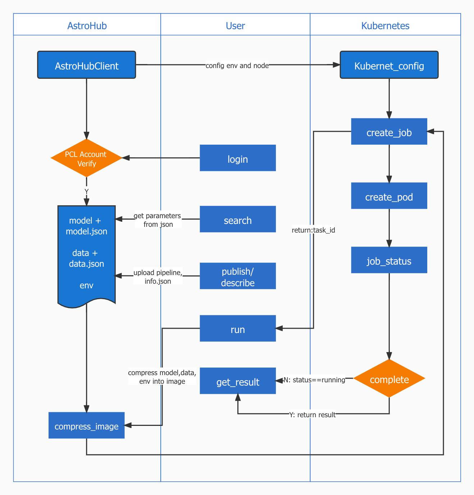

# AstroHub
An AI hub for astronomy and astrophysics. The platform, based on PCL Cloud Brain, provides a remote library for the pre-training model and dataset. It lets users complete the retraining and inference processes by executing a simple API locally.
## Structure
AstroHub, developed based on PCL Cloud Brain, mainly includes three modules, publish, search, and run. The Publish module accesses the remote computing node through the SSH command to complete the upload process of model and data pipeline. It then saves the corresponding information into JSON. The Search module can filter name, owner, domain to obtain the corresponding model/data list by parsing the JSON on the storage node. The Run module is based on the Kubernetes and Docker framework, allowing remote computing nodes to distributed execute the selected model and dataset.


<br/>
## Installation
### Environment
AstroHub operating environment is composed of Master node and Slave nodes. The physical machine requires to be configured with Kubernetes and Docker environment. Configuration instruction refers to [Kubernetes](https://kubernetes.io/docs/setup/), [Docker](https://docs.docker.com/get-started/overview/).
## Example Usage

The following sections are short introductions to using the AstroHub.

### Discovering and Running Models
Users interact with AstroHub by submitting requests to a REST API. 
In an effort to make using this API simple, the AstroHub contains a client that provides a Python API to these requests and hides the tedious operations.

To create the client, call

```python
from AstroHub.client import AstroHubClient

client = AstroHubClient('PCL_usrname','PCL_password')
```

#### Search the Model/Dataset
The client makes it simple to search models and dataset within AstroLibrary. 
For example, you can get all of the models on AstroHub by 

```python
res = client.search_all_model()
```

That function will return a Pandas DataFrame of models, which looks like:

<table border="1" class="dataframe">
  <thead>
    <tr style="text-align: right;">
      <th></th>
      <th>uuid</th>
      <th>name</th>
      <th>owner</th>
      <th>description</th>
    </tr>
  </thead>
  <tbody>
    <tr>
      <th>0</th>
      <td>356e8916-415b-11ec-972a-8c8590c0b3f0</td>
      <td>mnist_example</td>
      <td>rm</td>
      <td>An example for MNIST with NN</td>
    </tr>
    <tr>
      <th>1</th>
      <td>945360f7-d24f-4586-8835-218132734d34</td>
      <td>mnist</td>
      <td>rm</td>
      <td>MLP archieving 97.45% on the MNIST test data</td>
    </tr>
    <tr>
      <th>2</th>
      <td>d400a239-c252-4fec-bf17-a9ded50729ba</td>
      <td>test</td>
      <td>rm</td>
      <td>To find out if the function works</td>
    </tr>
  </tbody>
</table>

#### Run Models

Once you get the uuid of the model and dataset, it can be run through the client. If the user requires distributed execution, 
nodename and the amount of CPU, GPU can be passed as optional parameters to the run function.

```python
res = client.run(model_id,data_id,cpu,gpu,nodeName)
```
### Describing a Model/Dataset

To publish a model or dataset to the remote library requires to generate a JSON describing the metadata of the model/dataset

#### Describe the Model
By running describe function, we can simply provide much less metadata about the model to generate a json file
```python
from AstroHub.config.metaData import AstroHubMetaData

# Read in model from disk
AstroHubInfo = AstroHubMetaData()

# Define the name and title for the model
AstroHubInfo.set_title("A short title for the model")
AstroHubInfo.set_name("AstroHub")
AstroHubInfo.set_publication_date()
```
#### Describe the Dataset
Similar to describe model
```python
from AstroHub.config.dataset import BaseDataset

# Read in model from disk
dataset = BaseDataset()

# Define the basic info for the dataset
dataset.set_title("A short title for the dataset")
dataset.set_name("AstroHub")
dataset.set_owner("owner")
dataset.set_publication_date()
dataset.set_version("version")
dataset.set_type()

```
<!-- ### Model Parallelism -->
<!-- <br/> -->
## Project Support
This material is based upon work supported by PengCheng Lab.
